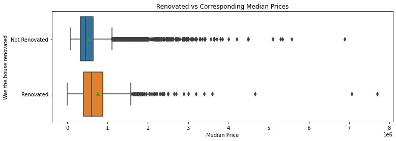
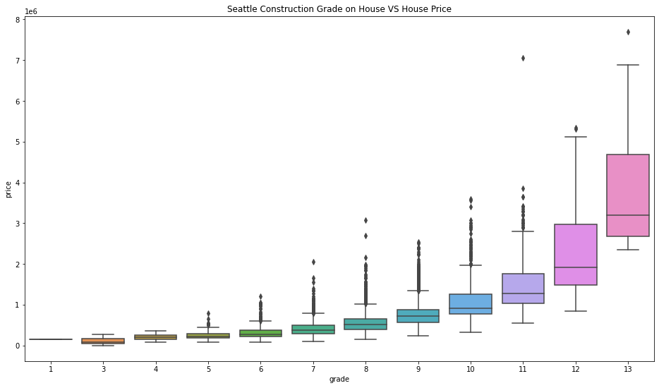
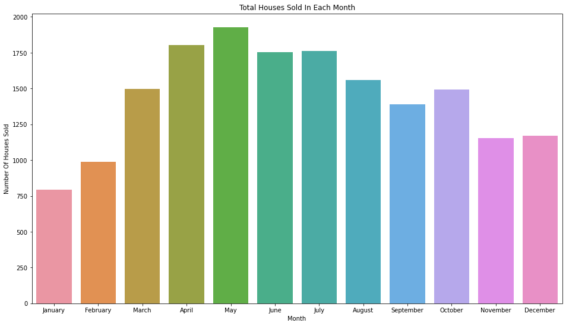

# KingCountyPredictions
---
by: Jacob Ash
 
---
 
## Overview
 
This project takes housing data from King County, WA to predict how much a house will be worth.  This uses information like location, size, and how well the house was built to come to these conclusions.
 
---
 
## Exploratory Data Analysis
 
Comparing different values to each other is a great way to predict price. 
 

 
From this, we can see that if a house is renovated, it will on average sell for a higher price compared to a house that has not been renovated
2 sample t-test has a p-value that shows these are NOT statistically significant on their own. However, when more variables are added, it does become important.
 

Here, we can see that getting a grade in the double digits will greatly impact the price of the house sold.  While you can meet average ratings, a higher rating will result in a higher price. The P-value from an ANOVA test is less than .05. This means that it correlates with price on its own. 
 

Based on this graph, we can see that selling in May is the most common time to sell, and buy.  Selling during this time will increase your chances of selling, and possibly at a higher cost due to higher competition. The P-value from an ANOVA test is less than .05, meaning that it correlates with price. Also, May has a high correlation with price while everything else is considered
 
---
## Feature Engineering
 
In addition to these, I created many more variables to help predict price, like yeard size, average bathrooms and bedrooms, and others.
 
---
## Prediction Modeling
Going through the Modeling process, I used Scikit Learn's K-best and Recursive Elimination to determine the 100 Variables I will use to predict price.
 
Using the Recursive Elimination algorithm, I received:
 
Training Root Mean Squared Error: 167674.50478989744
Testing Root Mean Squared Error: 162826.71510370827 with 100 variables.
 
Using K-best with the Polynomial, I received :
Training:  97682 vs. Testing:  170390. 
Comparing these two, we can see that the Recursive Elumanation algorithm not only has a smaller RMSE, it is also not overfitting.
 
---
## Conclusion
 
With these values in mind, for the final model, I went with the Recursive Elimination algorithm with the 100 variables that were determined. With this, I apply this to the holdout dataset to predict the prices of houses in King County.
